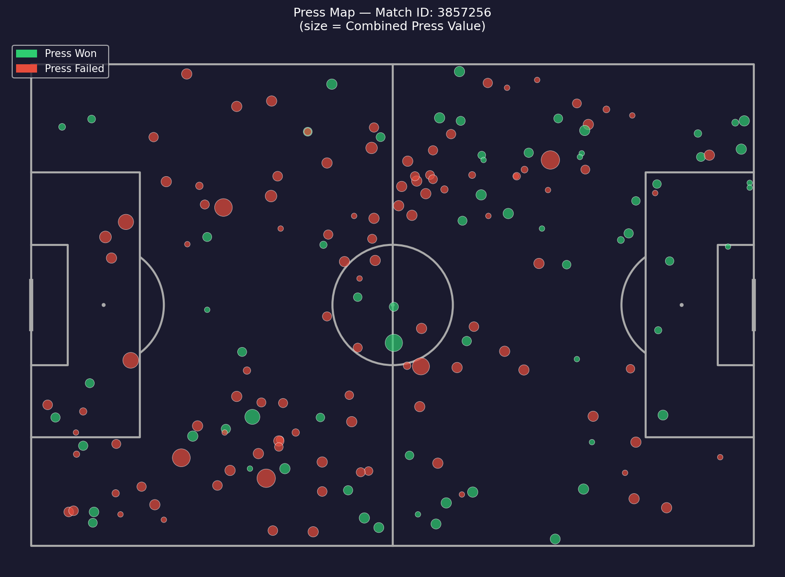

# Defensive Packing & Pass Network Disruption Index

> *Quantifying the spatial and network cost of pressing — FIFA World Cup 2022*



---

## The Idea

IMPECT's **packing metric** answers: *how many defenders did this pass or dribble bypass?*

This project builds the **defensive mirror**: when a team presses, how many attackers does it neutralize spatially — and how much does it damage the opponent's passing network simultaneously?

Pressing is **defensive packing**. This framework quantifies it.

---

## What This Is Not

Most pressing metrics give you one number — success rate (did the team win the ball?). That's a binary outcome that ignores two things:

1. **Where** the press happened spatially and how many players it neutralized
2. **Who** was pressed — pressing Rodri costs the opponent far more than pressing a fullback

This project fixes both.

---

## Metrics

### 1. Defensive Packing Score
From StatsBomb 360 freeze frames — counts how many attacking players are spatially neutralized at the moment of press. A defender within 5m of an attacker with no passing lane available = neutralized.

### 2. Pass Network Disruption Score
Built pass networks (directed weighted graphs) for every team in every match. Computed PageRank and betweenness centrality per player. The disruption score = the network importance of the player being pressed.

Pressing a player with PageRank 0.20 costs the opponent twice as much as pressing a player with PageRank 0.10 — even if both presses result in the same outcome.

### 3. Combined Press Value
Weighted composite of both dimensions:

```
Combined Press Value = 0.40 × Spatial Packing + 0.35 × Lanes Cut + 0.25 × Network Importance
```

Aggregated to player level (who is most valuable to press?) and team level (what is each team's pressing profile?).

---

## Dataset

| Metric | Value |
|---|---|
| Competition | FIFA World Cup 2022 |
| Data Source | StatsBomb Open Data |
| Total pressing sequences | 16,553 |
| Teams analyzed | 32 |
| Matches | 64 |
| Sequences with spatial data | 1,069 |
| Overall press success rate | 37.51% |

---

## Key Findings

### Otamendi > Messi (Network Centrality)
In Argentina's quarterfinal against Netherlands, **Cristian Romero and Otamendi had higher PageRank centrality than Messi** in Argentina's passing network. Netherlands' press targeting their defensive anchors was the right tactical call — their passing structure collapsed through the centre-backs, not the forwards.

### Rodrigo Hernández (Rodri) — Most Targeted Key Node
Rodri appears as a top press target across multiple matches — his betweenness centrality was consistently elite, making him the highest-value pressing target in Spain's system. Press him effectively and Spain's build-up collapses.

### Press Success Rate by Zone
| Zone | Success Rate | Volume |
|---|---|---|
| Defensive Third | ~38% | 5,363 sequences |
| Middle Third | ~32% | 7,247 sequences |
| Final Third | ~40% | 3,943 sequences |

Final third pressing is hardest to execute but yields the highest value when successful — directly adjacent to goal.

### Three Pressing Archetypes

**🔴 High Press Hunters** (6 teams)
Argentina, Brazil, England, Germany, Spain, United States
→ Highest final third pressing rates, 40.2% success rate

**🔵 Network Disruptors** (8 teams)
Australia, Ecuador, France, Japan, Mexico, Morocco, Senegal, Uruguay
→ Smarter positional targeting, press key network nodes rather than press everywhere

**🟡 Reactive Mid-Block** (18 teams)
Belgium, Croatia, Netherlands, Portugal, and others
→ Sit deeper, press reactively, lower volume but more selective

Morocco's classification as Network Disruptors is notable — they were one of the tournament's best defensive teams and their pressing was positionally intelligent, not high-volume. Their run to the semi-finals validates this archetype.

### XGBoost Press Trigger Model
Trained on 19 features to predict press success probability given game context.

| Metric | Value |
|---|---|
| ROC-AUC | 0.547 |
| 5-Fold CV AUC | 0.530 ± 0.008 |

The AUC plateau at 0.55 with event data is itself a finding — pressing success is spatially determined in ways event data cannot fully capture. The ceiling lifts significantly with full tracking data.

---

## Connection to Packing

IMPECT's packing metric quantifies **offensive value created** by bypassing defenders. This project quantifies **defensive value created** by neutralizing attackers and disrupting passing networks.

They are two sides of the same coin:

| IMPECT Packing | This Project |
|---|---|
| How many defenders bypassed? | How many attackers neutralized? |
| Offensive spatial value | Defensive spatial value |
| Pass/dribble as unit | Press as unit |
| Player-level attribution | Player-level attribution |

The natural extension of this work — with full tracking data rather than sampled freeze frames — would produce continuous spatial packing values for every defensive action, not just those near shots. That is the version this project points toward.

---

## Limitations

1. **Freeze frame sampling** — StatsBomb 360 freeze frames are sampled snapshots, not continuous tracking. Spatial packing scores are conservative estimates. Full tracking data would improve accuracy significantly.
2. **Shot-linked frames only** — defensive packing is computed from frames linked to nearby shots (~1,069 sequences). The remaining sequences use network features only.
3. **Event data ceiling** — pressing success from event data alone plateaus around AUC 0.55. Tracking data (speed, acceleration, defensive shape transitions) is required for meaningful predictive improvement.
4. **World Cup sample** — 64 matches from a tournament context. Club-level data across a full season would produce more stable pressing profiles.

---

## Project Structure

```
├── data/
│   ├── raw/
│   │   └── matches.csv
│   └── processed/
│       ├── pressing_sequences.csv
│       ├── team_profiles.csv
│       └── network_metrics.json
├── outputs/
│   ├── models/
│   │   └── xgboost_press_trigger.pkl
│   ├── plots/
│   │   ├── press_map_match1.png
│   │   ├── pass_network_match1.png
│   │   ├── radar_archetypes.png
│   │   ├── shap_summary.png
│   │   ├── roc_curve.png
│   │   └── team_clusters_pca.png
│   └── reports/
│       ├── team_archetypes.csv
│       └── player_leaderboard.csv
├── day1_starter.py        # Data pipeline & feature engineering
├── day2_modeling.py       # XGBoost model + clustering
├── day3_dashboard.py      # Streamlit dashboard
└── README.md
```

---

## Stack

| Tool | Purpose |
|---|---|
| `statsbombpy` | StatsBomb open data access |
| `networkx` | Pass network construction + centrality metrics |
| `xgboost` | Press trigger classification model |
| `shap` | Model explainability |
| `mplsoccer` | Football pitch visualizations |
| `plotly` | Interactive dashboard charts |
| `streamlit` | Dashboard frontend |
| `scikit-learn` | Clustering, preprocessing, evaluation |

---

## Run Locally

```bash
# Install dependencies
pip install statsbombpy mplsoccer networkx pandas numpy xgboost scikit-learn shap matplotlib seaborn plotly streamlit tqdm

# Build data pipeline (runs all 64 WC2022 matches — ~30 mins)
python day1_starter.py

# Train model + clustering
python day2_modeling.py

# Launch dashboard
streamlit run day3_dashboard.py
```

---

## Author

**Navjot** — Electrical Engineering student, Chitkara University
ML & Football Analytics | 1.5 years self-directed ML experience

[GitHub](https://github.com/NavjotML) · [LinkedIn](https://linkedin.com/in/) · [@barcaculerscountry](https://instagram.com/barcaculerscountry)

---

*Data: StatsBomb Open Data — used under the StatsBomb Open Data Licence*
